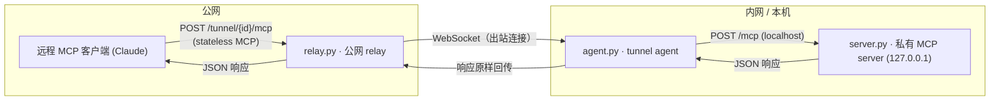

# MCP Tunnel Sample Server

一个 **MCP tunnel** 示例：把内网 / 本机里的私有 MCP server 安全地暴露给远程客户端（如 Claude），**不需要任何入站防火墙规则、公网端点或 IP 白名单**。

> 对应 Claude 的「MCP tunnels（research preview）」能力：
> "connect Claude to MCP servers inside a private network without exposing them to the public internet."
> 参考：https://claude.com/blog/bringing-mcp-2026-07-28-to-claude

## 架构



关键点：

- 只有 `relay` 暴露在公网；内网一侧**只主动向外建连**（agent → relay 的 WebSocket），不开放任何入站端口；
- 因为底层是 **MCP 2026-07-28 stateless**（没有会话），relay 不需要会话亲和性、不需要理解 JSON-RPC 内容：按 `tunnel_id` 找到 agent 连接，把 HTTP 请求转发过去、把响应转回来即可；
- 私有 server 只绑定 `127.0.0.1`（规范推荐本地绑定），由 agent 就近转发。

## 目录结构

| 文件 | 说明 |
| - | - |
| `server.py` | 私有 MCP server（stateless + JSON，只绑定 127.0.0.1） |
| `relay.py` | 公网 relay：`/register`、`WS /tunnel/{id}/agent`、`POST /tunnel/{id}/mcp` |
| `agent.py` | 内网 agent：WebSocket 出站连 relay，转发到本机 server |
| `client.py` | 标准库裸客户端，通过 relay 的公网 URL 走完整 stateless 流程 |
| `test_tunnel.py` | 端到端测试（真实进程 + 真实 WebSocket，随机端口） |
| `requirements.txt` | Python 依赖 |

## 运行

要求：Python 3.10+。

```bash
cd mcp/mcp-tunnel
python -m venv .venv && source .venv/bin/activate
pip install -r requirements.txt
```

三个终端分别启动：

```bash
# 1) 私有 server（只在内网可见）
uvicorn server:app --host 127.0.0.1 --port 9000

# 2) 公网 relay
uvicorn relay:app --host 0.0.0.0 --port 8000

# 3) 内网 agent（主动向外建连）
python agent.py --relay http://127.0.0.1:8000 --tunnel-id demo --local http://127.0.0.1:9000/mcp
```

另开一个终端，模拟「远程客户端」通过公网 URL 调内网工具：

```bash
python client.py http://127.0.0.1:8000/tunnel/demo/mcp
```

也可以直接 curl（stateless 头 + `_meta` 一个都不能少）：

```bash
curl -sS http://127.0.0.1:8000/tunnel/demo/mcp \
  -H 'Accept: application/json, text/event-stream' \
  -H 'MCP-Protocol-Version: 2026-07-28' \
  -H 'Mcp-Method: tools/call' \
  -H 'Mcp-Name: private_flag' \
  -H 'Content-Type: application/json' \
  -d '{"jsonrpc":"2.0","id":1,"method":"tools/call","params":{"name":"private_flag","arguments":{},"_meta":{"io.modelcontextprotocol/protocolVersion":"2026-07-28","io.modelcontextprotocol/clientInfo":{"name":"curl","version":"0.0"},"io.modelcontextprotocol/clientCapabilities":{}}}}'
```

## 测试

```bash
cd mcp/mcp-tunnel
python test_tunnel.py
```

端到端覆盖：`/register`、agent 出站 WebSocket 连上 relay、`server/discover` / `tools/list` / `tools/call` 经 tunnel 打通、内网秘密可见、无 `Mcp-Session-Id`、agent 断开后公网端点返回 503。

## 生产化方向（超出本示例范围）

- 给 `/register` 加鉴权，公网 MCP 端点开启 OAuth（`mcp` SDK 的 `streamable_http_app(..., auth=...)` 已支持）；
- relay 做多实例部署时，用 Redis/消息队列共享 `tunnel_id → agent` 路由表；
- 用 TLS（`wss`/`https`）承载 relay 与 agent 连接；给 `_meta` 的 `clientInfo` 透传做观测。
