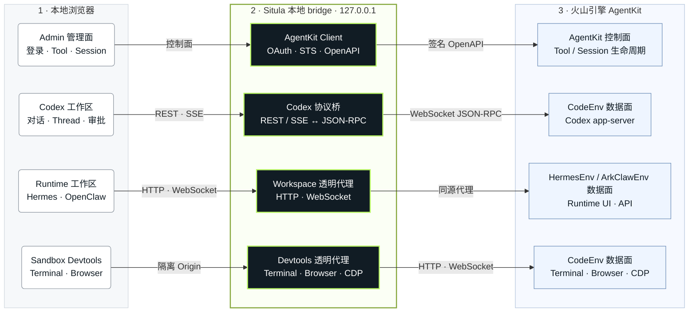

<div align="center">

  

</div>

<h1 align="center">Situla</h1>

<p align="center">
  <strong>面向 AgentKit Sandbox 的多 Agent 工作台</strong>
</p>

<p align="center">
  连接 AgentKit Tool Sandbox，在一个本地工作台中管理 Tool、启动 Session，
  并进入 Codex、Hermes 或 OpenClaw 工作区。
</p>

<p align="center">
  
  
  
</p>

## Situla 是什么

Situla 是一个运行在本机的 **AgentKit Tool Sandbox 客户端与多 Agent 工作台**。它通过
AgentKit 控制面发现 Tool、创建或选择 Sandbox Session，再连接该 Session 的运行时 Endpoint，
为 Codex、Hermes 和 OpenClaw 提供统一的管理入口与 End-user 工作区。

Situla **不是** AgentKit 的替代品，也不会在本机独立创建一套沙箱基础设施。Agent 实际运行在
火山引擎 AgentKit Sandbox Session 中；Situla 负责登录、资源管理、运行时路由以及浏览器与
Sandbox 之间的本地安全桥接。OAuth/STS 凭证和完整 Endpoint 只保留在本地 bridge 中，不会
交给浏览器存储。Codex 场景同时保留终端 CLI。

### 先了解 AgentKit Tool Sandbox

AgentKit 将沙箱分成控制面资源和运行时实例：

| 概念 | 是什么 | Situla 如何使用 |
| --- | --- | --- |
| **Tool** | 可复用的沙箱配置，定义 Tool 类型、镜像、启动方式、资源、网络和权限等。 | 登录后通过 `ListTools` 发现当前账号与地域下的 Tool。 |
| **Session** | 从一个 Tool 创建的临时沙箱实例，具有独立状态、TTL 和运行上下文。一个 Tool 可以有多个 Session。 | 列出现有 Session，或调用 `CreateSession` 创建新实例并等待其进入 `Ready`。 |
| **Endpoint** | Session 就绪后提供的运行时数据面地址，不是 AgentKit 控制面地址。 | 调用 `GetSession` 取得公网 `Endpoint`，再按 `toolType` 连接对应工作区。 |

换句话说，完整链路是：

```text
AgentKit Tool（沙箱模板）
        │ CreateSession
        ▼
Session（临时运行实例）
        │ Ready 后取得 Endpoint
        ▼
Situla 本地 bridge
        │ 按 toolType 路由
        ▼
Codex / Hermes / OpenClaw 工作区
```

Tool 的 `Ready` 只表示它可以用于创建 Session，不代表某个 Session 已经可访问；Situla 会继续
检查 Session 状态，并仅在 Session 就绪且返回 Endpoint 后进入运行时工作区。

### 安装后能直接用吗？

> [!IMPORTANT]
> **程序可以单文件安装后直接启动，但不能脱离 AgentKit 单独使用。**
> Situla 是连接 AgentKit Sandbox 的本地客户端，不是一个部署后自动提供 Agent 和沙箱的独立服务。

> [!NOTE]
> **当前版本仅支持火山引擎（Volcengine）AgentKit。BytePlus 的 AgentKit Sandbox
> 支持暂未上线，BytePlus 账号和控制面目前无法用于 Situla。**

开始使用前需要满足：

- 一个能够登录火山引擎控制台、并有权访问 AgentKit 的账号；
- 目标地域下至少有一个 Situla 支持且状态为 `Ready` 的 AgentKit Tool；Situla 当前不会创建
  Tool，需要先在 AgentKit 控制台或通过 AgentKit API 准备好；
- 本机能够访问 AgentKit 控制面和 Session 返回的公网 `Endpoint`。

不需要预先配置 AK/SK，也不需要提前手工创建 Session 或复制 Endpoint。首次启动后，Situla
会引导完成 OAuth 2.0 + PKCE 登录并获取本地 STS 临时凭证；选择一个已有 Tool 后，可以复用
现有 Session，也可以直接在界面中创建 Session。若账号下没有可用 Tool，Situla 可以启动和登录，
但不会凭空生成沙箱，也无法进入 Agent 工作区。

Situla 当前识别以下 AgentKit `toolType`：

| `toolType` | 工作区 | 说明 |
| --- | --- | --- |
| `CodeEnv` | Codex | 使用 Situla 内置 Codex Web UI，并连接 Sandbox 内的 Codex app-server。 |
| `HermesEnv` | Hermes | 通过本地 bridge 代理 Sandbox 自带的 Hermes UI、API 与 WebSocket。 |
| `ArkClawEnv` | OpenClaw | 通过本地 bridge 代理 Sandbox 自带的 OpenClaw UI、API 与 WebSocket。 |

其他 Tool 仍可显示和管理 Session，但没有匹配的 End-user 工作区。遗留 `Private` Tool 的兼容
方式见下文“Runtime 路由与 Private 兼容口”。

## 一键安装

无需 Node.js、npm 或源码仓库。安装脚本会自动识别系统与 CPU，下载匹配的独立二进制、
强制校验 SHA-256，并在安装后验证程序能够正常启动。当前发布目标为 Linux x64 与
macOS arm64。

```bash
curl -fsSL https://public-reading.tos-cn-beijing.volces.com/agentkit/situla/install.sh | sh
```

安装完成后，**新开一个终端**，然后启动：

```bash
situla start
```

如果希望在当前终端立即启动，macOS 默认 zsh 请执行：

```bash
source ~/.zshrc
situla start
```

## 为什么是 Situla

| | 能力 |
| --- | --- |
| **AgentKit 原生工作流** | 浏览全部 Tool，搜索、创建和切换 Sandbox Session，并自动取得 Endpoint。 |
| **多运行时工作区** | 统一管理 Tool/Session，并进入 Codex、Hermes 或 OpenClaw End-user 工作区。 |
| **完整 Codex 体验** | 流式对话、历史 thread、模型切换、快捷命令、审批与逐轮 token 用量。 |
| **沙箱开发工具箱** | 文件上传、交互式 Terminal、内置浏览器与 CDP 转发都在同一工作台中。 |
| **本地安全边界** | OAuth/STS 凭证和完整 Endpoint 只存在于本地 bridge，不进入浏览器存储或正常日志。 |
| **真正的单文件交付** | Web UI 内嵌在可执行文件中，下载后即可运行，无需安装运行时或依赖。 |

Codex 回复和 Situla 系统消息使用 CommonMark + GitHub Flavored Markdown 渲染，支持标题、
列表、引用、链接、表格、任务列表和代码块；用户输入保持纯文本。原始 HTML 不会执行，
Markdown 图片只显示为链接，不会自动加载远程资源。

第一次执行 `situla start` 时，Web UI 会显示火山引擎控制台登录页。登录采用 OAuth 2.0 + PKCE，
自动取得并刷新本地 STS 临时凭证，无需预先配置 AK/SK。登录统一使用手动授权回传：在任意浏览器
打开页面展示的链接，完成登录后将授权响应粘贴回 Web UI。因此同样适用于 SSH、容器和无图形界面环境。
登录成功后，Tool Admin 右上角可“退出登录”；该操作仅删除 Situla 本地的 Console Login token cache。

需要变更地域、签名服务、控制面 Host、超时或本地监听参数时，运行：

```bash
situla config
```

配置保存于 `~/.config/situla/config.json`（若设置 `XDG_CONFIG_HOME` 则位于对应目录）。
这些字段沿用环境变量风格的名称，但都只表示 JSON
配置字段：除 Private Tool 的兼容映射外，Situla 不读取任何 AgentKit 凭证或运行参数环境变量；
所有持久化运行参数按“`config.json` → 内置默认值”解析。OAuth token
cache 独立保存在 `login/cache/console-login.json`，目录为 0700、文件为 0600。

| 配置字段 | 是否必需 | 默认值 | 用途 |
| --- | --- | --- | --- |
| `VOLCENGINE_REGION` | 可选 | `cn-beijing` | AgentKit 控制面地域，必须与 Tool 所在地域一致。 |
| `VOLCENGINE_SERVICE` | 可选 | `agentkit` | AgentKit 请求使用的 HMAC 签名 Service。 |
| `VOLCENGINE_HOST` | 可选 | `agentkit.${region}.volcengineapi.com` | 控制面 Host；只填写主机名，可选端口，不含协议。 |
| `AGENTKIT_HTTP_TIMEOUT` | 可选 | `30` | 控制面单次请求超时，单位为秒，必须为正数。 |
| `AGENTKIT_HTTP_RETRIES` | 可选 | `2` | `ListTools` / `GetSession` 等控制面请求的额外重试次数，必须为非负整数。 |
| `SITULA_HOST` | 可选 | `127.0.0.1` | bridge 监听地址；仅应使用 loopback 地址。 |
| `SITULA_PORT` | 可选 | `8787` | bridge 监听端口，范围 `0`–`65535`。 |
| `SITULA_ORPHAN_GRACE_MS` | 可选 | `60000` | 浏览器 SSE 全部断开后，释放 bridge session 前的宽限时间，单位为毫秒。 |

### Runtime 路由与 Private 兼容口

Situla 根据控制面返回的真实 `toolType` 逐个决定工作区：

| `toolType` | End-user 入口 | 数据面 |
| --- | --- | --- |
| `CodeEnv` | `/codex` | Situla CodexApp 连接 `/v1/codex/app-server/`。 |
| `HermesEnv` | `/hermes` | bridge 反向代理沙箱自带 Hermes UI、API 与 WebSocket。 |
| `ArkClawEnv` | `/openclaw` | bridge 反向代理沙箱自带 OpenClaw UI、API 与 WebSocket。 |

遗留的 `Private` Tool 默认不路由。确有兼容需要时，可以在启动进程上设置环境变量
`SITULA_PRIVATE_TYPE`，值只能是区分大小写的 `CodeEnv`、`HermesEnv` 或 `ArkClawEnv`：

```bash
SITULA_PRIVATE_TYPE=CodeEnv situla start
```

未设置或值不匹配时，Private Tool 仍可管理 Session，但不能进入 Runtime Workspace。旧
`config.json` 中的 `TOOL_TYPE` 会被忽略，并在下一次执行 `situla config` 保存时移除。

Hermes/OpenClaw 页面及其 HTTP、WebSocket 请求通过本地 bridge 同源代理，真实 Session
Endpoint 和鉴权 query 不会进入浏览器 URL。

启动后打开：

```text
http://127.0.0.1:8787
```

首次进入会通过 `ListTools` 展示所有 Tool 类型，默认每页 10 条；可按名称、ID 或描述
模糊筛选；最近进入的 3 个 Tool 会自动进入当前登录账号隔离的浏览器常用列表。选择 Tool 后，Session 页面会通过
`ListSessions` 展示该 Tool 的实例。选择实例时，bridge 调用 `GetSession`
取得 Endpoint，并根据 Tool 的真实 `toolType` 打开 Codex、Hermes 或 OpenClaw
工作区。“创建新实例”会调用 `CreateSession`，支持设置
`UserSessionId` 和 TTL，并在实例 Ready 后更新 Session 列表。

以下功能仅适用于 Codex End-user 工作区。左侧栏可查看当前 AgentKit Session 并返回 Admin
Session 列表；“发起任务”新建 Codex thread，下方通过 app-server
的 `thread/list` 读取沙箱内保存的对话。点击历史 thread 会调用 `thread/resume` 并恢复消息；
还可以搜索、分页加载、分叉和归档。历史仍保存在沙箱的
Codex state 中，Situla 不会把 transcript 复制到浏览器存储。

输入框左下角从左到右提供 `+`、`权限管理` 和 `工作空间`。`+` 菜单支持把本地文件上传到
当前工作目录；“工作空间”通过 app-server 的 `fs/readDirectory` 浏览远程目录，并用
`thread/settings/update` 设置当前 thread 的 `cwd`。工作目录只能在发送第一条消息前修改，
对话开始后 bridge 也会拒绝对应 API 请求；新建空 thread 后重新解锁。

“权限管理”以带说明的选项展示 `sandbox_mode`、`approval_policy` 和
`approvals_reviewer`，并允许配置 workspace-write 网络访问。保存时先通过 `config/read`
获取用户配置版本，再使用 `config/batchWrite` 原子更新远程 AgentKit Session 内的
Codex `config.toml`，同时启用 `reloadUserConfig` 热加载；随后通过
`thread/settings/update` 同步当前 thread，并在后续 `turn/start` 中携带同一组权限，
因此当前对话的下一条消息会立即使用新设置。新建、切换或分叉 thread 时也会重新同步。
设置持续到远程 Session 被销毁。`danger-full-access` 配合 `never` 会绕过 Codex sandbox
且不再请求操作审批，只应在可信任务中启用。

Terminal 直接在 iframe 中展示 CodeEnv 原生 `/terminal`，其页面资源和 `/v1/shell/ws`
均经本地 bridge 透明转发。iframe 使用独立的本地 origin，且不会拿到 Endpoint 的鉴权参数。
输入框右下角可以直接读取并切换当前 thread 模型，与 `/model` 使用同一套 app-server API。

右上角设置菜单中的“沙箱浏览器”会打开 Terminal 风格的站内浮层，并通过 iframe 显示
aio-sandbox 内置 browser-ui；浮层支持刷新、全屏 / 收起和关闭。页面资源、browser info 和
CDP WebSocket 均由 bridge 转发，iframe 不会获得 Endpoint 的鉴权 query；沙箱页面运行在
独立的本地 origin，不与 Situla 控制界面共享脚本上下文。

在输入框键入 `/` 会打开快捷命令面板，支持 `↑` / `↓`、`Tab`、`Enter` 和 `Esc`：

- `/model [model]`、`/models`：读取或切换 app-server 模型
- `/new`、`/clear`：开始新对话
- `/resume [thread]`：打开会话栏或直接恢复指定 thread
- `/fork`、`/compact`、`/archive`：分叉、压缩或归档当前对话
- `/status`、`/help`：查看当前状态或命令帮助

这些命令由 Situla 映射到 app-server API，不会作为普通 prompt 发给模型。

## 从源码开发

开发需要 Node.js 22.6 或更新版本：

```bash
npm install
npm run build
npm start -- config
npm start -- start
```

`npm run preview` 会先构建 React 前端，再通过统一 CLI 启动本地 bridge。只重新启动已构建版本时：

```bash
npm start -- start
```

开发模式需要两个终端：

```bash
# terminal 1: API bridge，修改后自动重启
npm run dev:server

# terminal 2: Vite HMR，访问 http://127.0.0.1:5173
npm run dev
```

## 架构

Web UI 分为 Admin 与 End-user 两层。`/` 是 Admin 管理面，负责登录、Tool 与 Session
管理以及工作区选择；End-user 工作区可以是 Situla 内置的 `/codex`，也可以是由沙箱提供并经
bridge 同源代理的 `/hermes` 或 `/openclaw`。Admin 与 Codex 共用 API、类型和基础样式，
但拥有独立的 React 入口、代码块与运行状态；Hermes/OpenClaw UI 不编入 Situla 前端。

Codex app-server 会拒绝包含浏览器 `Origin` header 的 WebSocket 握手，浏览器本身无法
移除该 header。因此 Web 版使用同源 bridge：



四条泳道分别对应控制面、Codex、Hermes/OpenClaw 和 Sandbox Devtools。控制面取得
Session 的 `Endpoint` 与 `toolType` 后在 Situla 内部完成路由，图中省略这条内部交接线以保持
控制面与数据面链路清晰。

不要把 bridge 暴露在公网：Console Login 用于获取 AgentKit 临时凭证，并非 Web 服务的多用户访问控制；bridge 仍具有向 Codex 回复命令和文件审批的能力。
浏览器请求需要同源 `Host` / `Origin` 和随机 HttpOnly capability cookie；这些措施用于阻止
跨站网页驱动 loopback API，不构成对本机恶意进程的身份认证。非 loopback Host 会被拒绝。

## 终端客户端

原有 CLI 作为 `chat` 子命令保留。如果已导出 `SANDBOX_URL`：

```bash
situla chat
```

单次调用、恢复 thread 或覆盖工作目录：

```bash
situla chat --prompt '只回复：connected'
situla chat --thread THREAD_ID
situla chat --cwd /home/gem/workspace --model MODEL_NAME
```

交互模式支持 `/new`、`/thread`、`/help` 和 `/exit`。CLI 默认在 Codex 请求执行命令或
修改文件时询问用户，也支持显式的 `--approval accept|reject`。

## 安全行为

- OAuth 授权码、STS token 和 Endpoint 查询参数不会发送到浏览器持久化存储；正常日志只显示脱敏 Endpoint。
- Web UI 不使用 `localStorage` 或 `sessionStorage` 保存 URL；最近使用的 3 个常用 Tool 只保存
  `ListTools` 已返回的公开元数据。
- bridge 默认仅绑定 loopback；关闭 session 时会清空保存的 URL 并拒绝未处理审批。
- 页面关闭会尽力发送 DELETE；SSE 全部断开后另有 60 秒重连宽限，超时自动释放 session。
- 浏览器 API 使用进程级随机 capability cookie，并校验 loopback Host 与同源 Origin。
- 静态页面包含 CSP、`frame-ancestors`、`nosniff` 和 no-referrer 等安全响应头。
- 沙箱原生 terminal 和 browser-ui 复用 Situla 端口并切换 `localhost` / `127.0.0.1`
  loopback 主机名，与控制 UI 跨 origin；返回前端的 terminal/browser/CDP URL 会移除 Endpoint query。
- 动态权限扩张默认返回 turn 级空权限集。
- Session 权限只能由本地用户显式保存；Situla 通过 app-server 的配置 RPC 更新远程
  `config.toml`，不会直接拼接或覆盖 TOML 文件。
- 未实现的 server request 返回 `method not found`，不会静默放行操作。
- thread 和聊天上下文位于沙箱内；沙箱销毁后 URL 与 thread id 都会失效。

## 开发与验证

源码开发支持 Node.js 22.6 或更高版本。官方单文件二进制统一使用 `.node-version`
中记录的 Node.js 24.18.1 LTS 构建；Linux 和 macOS 发布产物必须使用相同的 Node.js
版本与 `package-lock.json`。使用 nvm 时可直接运行：

```bash
nvm install
nvm use
npm ci
```

构建当前操作系统和 CPU 架构的自包含二进制：

```bash
npm run build:binary
# Linux x64 示例：dist/situla-v0.1.0-linux-x64 和对应的 .sha256 文件
```

Node SEA 二进制绑定构建机的平台和架构，因此 Linux x64、Linux arm64、macOS x64、
macOS arm64 需要分别在对应 runner 上构建。安装脚本会用 `uname` 选择匹配的文件，默认从
Situla 的 TOS 发布目录下载；也可以通过 `SITULA_DOWNLOAD_BASE_URL` 使用其他镜像源。
安装脚本默认安装 `0.1.0`，也可以通过 `SITULA_VERSION` 选择其他已上传版本：

```bash
curl -fsSL https://public-reading.tos-cn-beijing.volces.com/agentkit/situla/install.sh |
  SITULA_VERSION=0.1.0 sh
```

```bash
npm run typecheck
npm test
npm run build
npm run build:binary
dist/situla-v0.1.0-linux-x64 --help
dist/situla-v0.1.0-linux-x64 licenses
(cd dist && sha256sum -c situla-v0.1.0-linux-x64.sha256)
```

当前自动化测试覆盖 URL 转换与脱敏、初始化握手、流式 turn、fallback 文本、审批响应、
历史 thread 解析与恢复、模型配置、快捷命令筛选、断线/回调隔离、bridge 事件重放、并发
turn、提前 interrupt、UI 事件降级、本地 API 的 capability / Origin 防护，以及 browser-ui
HTTP / CDP WebSocket 代理和凭据脱敏。使用短期测试
URL 还完成了真实 bridge 烟测：Web API 建立 session，SSE 收到 turn 事件，最终返回
`WEB_REVIEW_OK`。

## 开源与许可证

Situla 源码使用 [Apache License 2.0](LICENSE)。单文件二进制还包含 Node.js 和生产环境
npm 依赖，其完整版权与许可证文本收录在
[THIRD_PARTY_NOTICES.txt](THIRD_PARTY_NOTICES.txt)，并嵌入每个发布二进制：

```bash
situla licenses
```

第三方清单由 `npm run licenses` 根据锁文件和构建所用 Node.js 发行包自动生成。发布流程、
平台构建和 macOS 签名要求见 [docs/RELEASING.md](docs/RELEASING.md)。提交代码前请阅读
[CONTRIBUTING.md](CONTRIBUTING.md)，安全问题请按照 [SECURITY.md](SECURITY.md) 私下报告。

## AgentKit 客户端身份

这个部署中 `initialize.clientInfo.name` 不只是展示名称：Codex 会将它保存为 app-server
client identity，并传入 thread、hook 和上游请求相关元数据。Situla 使用 AgentKit 参考
客户端相同的 `agentkit_codex_app_server_client`，以进入该镜像现有的 provider 兼容路径。
