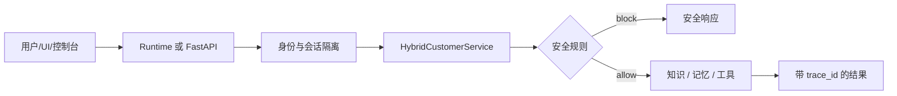

# Agent 内部实现与混合云开发手册
这个样例把“业务编排”与“平台托管”分开：`demo_core.py` 可在无云凭据的情况下单测，`agent.py` 将它封装为 VeADK/AgentKit Runtime Agent，知识库、记忆、会话和身份由平台关联并注入。仓库不保存任何密钥。

## 1. 请求链路



- UI 使用 `POST /api/chat` 或 `POST /api/a2ui`。
- 控制台 demo 模式使用 `POST /invoke` 和 `prompt`。
- live 模式由 `AgentkitAgentServerApp` 执行 VeADK Agent。

```python
# agent.py：把可测试的业务核心包装成 Agent tool
def customer_service_demo(message: str, tenant_id: str = "demo-bank",
                          user_id: str = "user-001", session_id: str = "session-001") -> str:
    return json.dumps(service.chat(
        message, tenant_id=tenant_id, user_id=user_id, session_id=session_id
    ).to_dict(), ensure_ascii=False)
```

## 2. 构建 Agent：模型、工具与平台资源

平台开发的关键是：先在控制台创建/关联资源，再由 Runtime 向容器注入连接信息；代码只在变量存在时启用能力。

```python
# agent.py
def build_agent():
    from veadk import Agent
    knowledge = build_platform_knowledge("hybrid_cloud_customer_service")
    memory = build_platform_memory("hybrid_cloud_customer_service")
    options = {}
    if knowledge:
        options["knowledgebase"] = knowledge
    if memory:
        options["long_term_memory"] = memory
        options["auto_save_session"] = True
    return Agent(
        name="hybrid_cloud_customer_service", instruction=INSTRUCTION,
        model_name=settings.model_name, model_api_key=settings.model_api_key,
        model_api_base=settings.model_api_base, tools=[customer_service_demo], **options,
    )
```

```bash
# 本地确定性模式：不需模型密钥
DEMO_MODE=demo uv run --frozen agent.py

# live 模式：仅从终端/平台注入模型变量
export DEMO_MODE=live
export MODEL_AGENT_NAME=<model-endpoint-id>
export MODEL_AGENT_API_KEY=<model-api-key>
export MODEL_AGENT_API_BASE=<openai-compatible-base-url>
uv run --frozen agent.py
```

## 3. 业务编排：先安全，后状态变更

`HybridCustomerService.chat()` 是决策中心：每请求先加载租户会话，再在知识检索、Memory 写入或工单创建前做注入攻击检测。

```python
# demo_core.py
state = self.sessions.load(tenant_id, user_id, session_id)
events.append(CapabilityEvent("session.load", detail={"backend": self.sessions.mode}))

if detect_attack(message):
    return AgentResponse("该请求包含越权或敏感操作指令，已被安全策略拦截。", ...)

order = self.crm.create_work_order(
    user_id=user_id, channel=channel, idempotency_key=f"{session_id}:refund"
)
```

规则：所有读写都以 `tenant_id + user_id + session_id` 隔离；偏好不是授权；写入必须幂等且经用户确认；每次响应返回 `trace_id` 和 `events`。

## 4. 知识库：云搜索关联后适配为 VeADK KnowledgeBase

混合云知识库后端是云搜索。知识库须先在 **AgentKit → 知识库** 创建并发布，再关联并发布 Runtime。完成后平台会注入 `KNOWLEDGE_BASE_URL`（真实 HTTP Base URL）与 `KNOWLEDGE_BEARER_TOKEN`（短期 Bearer Key）。Agent 直接使用这两个环境变量；它们无需、也不应手工写入镜像或仓库。Runtime 入站请求的 `Authorization` 只用于网关身份认证，绝不能作为知识库或其他下游服务的凭证；平台未注入知识库专用凭证时应跳过检索。

```python
# platform_knowledge.py
endpoint = os.getenv("KNOWLEDGE_BASE_URL", "").rstrip("/")
token = os.getenv("KNOWLEDGE_BEARER_TOKEN", "")
if not endpoint or not token:
    return None

response = requests.post(
    f"{endpoint}/v1/search",
    json={"question": query, "history_chats": [], "top_k": top_k},
    headers={"Authorization": f"Bearer {token}"}, timeout=20,
)
```

`KnowledgeBase` 必须以自定义 `BaseKnowledgebaseBackend` 实例构造。不可只继承 `KnowledgeBase` 后重写 `search`：VeADK 会先初始化默认 `backend=local`，从而引入未打包的 `llama_index` 并使 Runtime 启动失败。

```bash
curl -X POST '<runtime-endpoint>/invoke' \
  -H 'Authorization: Bearer <runtime-api-key>' -H 'Content-Type: application/json' \
  -d '{"prompt":"上周买的理财产品可以退吗？"}'
```

期望：结果含知识引用，Runtime 日志含 `Knowledge search completed`。若日志显示 `Knowledge search skipped: no bearer token in request`，说明调用没有携带 Authorization 请求头。

## 5. Memory 与 Session：两层状态分工

- 短期会话：`ShortTermMemory`；AgentKit 关联 PostgreSQL 会注入
  `DATABASE_POSTGRESQL_HOST/PORT/USER/PASSWORD/DATABASE`。VeADK 的
  PostgreSQL backend 自动读取这五个变量；不在应用中手工拼接或记录连接串。
  `SESSION_DATABASE_URL` 仅保留给本地开发的显式覆盖。
- 长期记忆：MEM0；VeADK 的 `auto_save_session` 在请求完成后读取已持久化会话并写入
  `LongTermMemory`。同一用户切换 session 时会强制保存上一 session。

```python
# agent.py
if all(os.getenv(key) for key in (
    "DATABASE_POSTGRESQL_HOST", "DATABASE_POSTGRESQL_PORT",
    "DATABASE_POSTGRESQL_USER", "DATABASE_POSTGRESQL_PASSWORD",
    "DATABASE_POSTGRESQL_DATABASE",
)):
    # VeADK 从环境变量读取配置，并处理密码编码与驱动兼容性。
    short_term_memory = ShortTermMemory(backend="postgresql")
else:
    short_term_memory = ShortTermMemory(backend="local")

# platform_memory.py
requests.post(f"{endpoint}/v1/memories/", headers=headers, json={
    "messages": [{"role": "user", "content": event_string}],
    "user_id": user_id, "async_mode": True, "version": "v2",
})
```

验证：相同 `tenant_id/user_id`、不同 `session_id` 读取偏好；更换 tenant 或 user 必须读不到该偏好。

### 仅验证 PostgreSQL 会话（排除长期记忆影响）

长期记忆会跨会话检索，不能用它证明 PostgreSQL 短期会话是否持久化。验收时可临时配置
`ENABLE_LONG_TERM_MEMORY=false` 并发布 Runtime；此开关默认 `true`，生产环境无需设置。
关闭后使用相同 `user_id + session_id` 写入一个验证码，重启实例，再用相同会话提问。
若仍能读到验证码，且日志不含 `long_term_memory.py ... Search memory`，即证明由 PostgreSQL
会话恢复。验收完成后删除该变量或恢复为 `true`，重新发布。

## 6. Identity 身份权限：网关验签，Agent 保留业务边界

Identity 与 Session 是两个模块：Identity 回答“该请求是谁发起、是否允许访问”，Session 回答“该用户在此会话中先前说过什么”。Identity 不保存会话历史；Session 也不能替代认证或授权。

生产中由 AgentKit 网关/用户池验签 JWT；Runtime 只消费已验签 claims，不信任 Body 声明的身份。

### 在线测试与最终回答

Runtime 的 `POST /invoke` 返回 `text/event-stream`。AgentKit 在线测试面板显示的是完整 SSE 原文，不会像聊天 UI 一样自动拼接最终回答：

- `content.parts[].thought=true` 是思考事件，不应作为用户可见答案；
- `partial=true` 是流式增量，不能单独作为完整回答；
- 最终回答取后续 `thought != true` 的 `content.parts[].text`；
- HTTP 200 证明 OAuth JWT/API Key、Origin 检查和 Runtime 路由已通过，但仍需确认事件流正常结束并包含最终文本；
- 缺失或无效凭据应返回 401/403。

本地 UI 的 BFF 会解析这些事件，将思考过程放进可折叠区域，只在消息气泡显示最终回答。点击“身份自检”会发送“你是谁”的明确验收提示词，各快捷按钮的悬停提示给出对应能力的预期结果。

```python
# platform_capabilities.py
claim_tenant = str(claims.get("tenant_id", tenant_id))
claim_user = str(claims.get("sub", user_id))
if claim_tenant != tenant_id or claim_user != user_id:
    raise PermissionError("request identity does not match gateway claims")
```

配置：创建用户池 → 网关配 JWT 认证 → 路由到 Runtime → 使用有效/无效 token 验证。

## 7. Sandbox、MCP、Skill 与 A2A

### Sandbox

在 **AgentKit → 工具** 创建 AIO Sandbox 并关联 Runtime 后，平台会注入 `AGENTKIT_TOOL_ID`、`AGENTKIT_TOOL_REGION`、`AGENTKIT_TOOL_HOST` 与 `AGENTKIT_TOOL_SCHEME`。本样例在 live Agent 中直接注册 VeADK 内置 `run_code`；该工具读取这些注入变量，并用 ToolContext 中的 `agent_name + user_id + session_id` 作为平台 Sandbox 的执行隔离键。应用不自行构造或记录工具凭据。

```python
# agent.py
from veadk.tools.builtin_tools.run_code import run_code

tools = [customer_service_demo]
if os.getenv("AGENTKIT_TOOL_ID"):
    tools.append(run_code)

Agent(name="hybrid_cloud_customer_service", tools=tools, ...)
```

为保证安全，系统提示要求 `run_code` 只用于当前客服任务的 Python3 隔离计算，最长 15 秒，不安装软件包、不访问网络、不读取无关文件。未关联工具的本地运行不注册 `run_code`；`sandbox_calculate` 仍只作为 demo/test 回退，不可当成平台调用证据。

```python
if any(char not in set("0123456789+-*/(). %") for char in expression):
    raise ValueError("sandbox expression contains unsupported characters")
```

### MCP

平台验收链路是“部署 MCP 服务 → 创建 MCP 工具集 → Runtime 关联工具集 → 重新发布”，而不是让业务代码直连单个 MCP 服务。发布后平台注入 `TOOL_MCP_ROUTER_URL` 与 `TOOL_MCP_ROUTER_API_KEY`，`platform_mcp.py` 将混合云 Base URL 规范化为 Streamable HTTP 的 `/mcp` 入口，再延迟注册 VeADK 内置 `mcp_router`。若平台已经注入完整 `/mcp` 地址则保持不变。工具范围和路由策略在 MCP 工具集治理，业务代码不保存服务 URL/Key。完整代码与验证命令见 [MCP 服务接入与验收](mcp_validation.md)。本地 `POST /mcp` 只保留给离线 JSON-RPC 协议单测。

```python
elif method == "tools/list":
    result = {"tools": [{"name": "calculate_transaction_summary",
        "inputSchema": {"type": "object", "properties": {}}}]}
```

### Skill 与 A2A

Skill 包位于仓库共享目录 `../../../skills/byted-customer-service-compliance/SKILL.md`。Skills Sandbox 与 AIO Sandbox 是两种不同的工具：前者执行已发布的 Skill 工作流，后者执行隔离代码。一个 Runtime 只关联一个 Tool，平台以通用的 `AGENTKIT_TOOL_ID` 注入当前关联工具的 ID。样例同时暴露两个 VeADK 客户端函数，以支持操作者在请求中明确指定需要 `run_code` 或 `execute_skills`；用户没有明确指定时，Agent 必须先追问，不得猜测 Tool 类型。

Skills 中心与 Skills Sandbox 分工不同：`AGENTKIT_TOOL_ID` 选择**执行** Sandbox，`SKILL_SPACE_ID` 选择要被 Agent 加载的 **Skills 空间**（形如 `ss-...`）。本样例读取 `SKILL_SPACE_ID` 后构造 `Agent(skills=[...], skills_mode="skills_sandbox")`。VeADK 在启动时对每个 Space ID 调用 `ListSkillsBySpaceId`，得到 Skill 的名称、描述与存储位置，并把这些元数据加入 Agent 指令；随后只有用户明确请求时，`execute_skills` 才会在当前关联的 Skills Sandbox 中执行工作流。一个变量中可用逗号分隔多个空间 ID。

在混合云 Runtime 中，平台把 Skills 管理面注入为 `VOLCENGINE_AGENTKIT_HOST` / `VOLCENGINE_AGENTKIT_SCHEME`，而 VeADK 的 Skills 加载器读取 `AGENTKIT_SKILL_HOST` / `AGENTKIT_TOP_SCHEME`。样例在构造 `Agent` 前仅在未显式配置的情况下做映射，避免 SDK 默认退回公网 `agentkit.<region>.volcengineapi.com`：

```python
def configure_hybrid_skills_endpoint() -> None:
    for target, source in (
        ("AGENTKIT_SKILL_HOST", "VOLCENGINE_AGENTKIT_HOST"),
        ("AGENTKIT_TOP_SCHEME", "VOLCENGINE_AGENTKIT_SCHEME"),
    ):
        if not os.getenv(target) and os.getenv(source):
            os.environ[target] = os.environ[source]
```

这不是覆盖用户设置：若 Runtime 显式注入 `AGENTKIT_SKILL_HOST` 或 `AGENTKIT_TOP_SCHEME`，显式值优先。`veadk-python==0.5.40` 会把 `SKILL_SPACE_ID` 传入关联 Sandbox；本样例还通过一个同签名的轻量包装函数传递 `CLOUD_PROVIDER=vestack`、TOP endpoint 和调用范围的 IAM 凭据。原因是 Runtime 与隔离 Skills Sandbox 是两个进程：后者也必须知道自己处于混合云，才能走 VeADK 的 `GenTempTosObjectDownloadUrl` 分支下载 MinIO 中的已发布 Skill。没有手写 MinIO endpoint、bucket 或长期对象存储密钥。

```python
# agent.py
skill_space_ids = [item.strip() for item in os.getenv("SKILL_SPACE_ID", "").split(",") if item.strip()]
if skill_space_ids:
    optional_features["skills"] = skill_space_ids
    optional_features["skills_mode"] = "skills_sandbox"
    optional_features["enable_dynamic_load_skills"] = True
```

```python
# agent.py（省略 import）
def execute_skills(workflow_prompt: str, tool_context: Context = None) -> str:
    return run_sandbox_agent(
        workflow_prompt=workflow_prompt,
        tool_id=resolve_agentkit_tool_id("AGENTKIT_TOOL_ID_SKILLS"),
        tool_context=tool_context,
        timeout=900,
        extra_env_vars=hybrid_skills_sandbox_env(tool_context.state),
    )

if os.getenv("AGENTKIT_TOOL_ID"):
    tools.append(run_code)
    tools.append(execute_skills)
```

`execute_skills(workflow_prompt, tool_context)` 使用平台注入的 `AGENTKIT_TOOL_ID`，在关联的 Skills Sandbox 执行工作流；`run_code` 也使用相同 ID，但只用于当前关联的是 AIO Sandbox 且用户明确指定的场景。

本样例已经在线验证的是：Skills 中心发布的 `byted-customer-service-compliance` 被 `ListSkillsBySpaceId` 加载，随后 `execute_skills` 创建隔离 Sandbox 并执行该 Skill。验收日志的关键字为 `Successfully loaded skill ...` 与 `Invoke run sandbox agent response`。混合云中，VeADK 通过 AgentKit TOP 换取 MinIO 临时下载 URL；业务代码不应写入 AK/SK、MinIO endpoint、bucket 或 TOS 路径。

官方还提供一条进阶动态创建链路：内置 `skill-creator` 创建 Skill → 内置 `tos-file-access` 上传 Skill → 执行 Skill。但 `tos-file-access` 必须有可写 Bucket 或 Tool 存储配置。当前验证环境的 Tool 存储配置为 `--`，临时 Sandbox 也没有 `TOS_SKILLS_DIR`、Bucket 或 MinIO/S3 环境变量，因此上传不是当前链路的验收项；不要猜测 `agentkit-platform-*` Bucket 名称。待平台明确配置真实 Bucket 后再执行该步骤。

```text
请明确调用 execute_skills：按已发布的 byted-customer-service-compliance Skill
检查理财产品退款是否需要人工确认；返回 Skill 名称、合规结论和执行摘要。
```

Skill 中心的包管理适合独立治理和预发布；本次已经完成的是“发布包 → Space 加载 → Sandbox 执行”验证。动态创建和上传留待存储资源配置完成后执行。Sandbox 实例默认约 5 分钟自动释放，平台实例管理页的“修改生命周期”负责调整；调用中的 `timeout` 只决定客户端等待时长。

### A2A：独立数据 Agent、Card 发现和标准委派

真实 A2A 不复用 `demo_core.py` 中的本地 fallback。项目增加 [a2a_data_agent.py](../a2a_data_agent.py)，由与主 Agent 相同的镜像通过 `AGENT_APP_MODE=a2a_data_analyst` 启动，暴露标准的 Agent Card 与 JSON-RPC 入口：

```text
GET  /.well-known/agent-card.json
POST /a2a                  # method: message/send
```

该 Card 声明 `complaint-trend-analysis` Skill。主客服 Runtime 仅在配置 `A2A_DATA_AGENT_URL` 后注册委派工具；它通过 [a2a_client.py](../a2a_client.py) 先读取 Card 校验 Skill，再携带请求数据发送 `message/send`。对端 Key 通过 `A2A_DATA_AGENT_API_KEY` 注入，绝不进入 UI 或业务日志。

```python
# agent.py
tools = [customer_service_demo]
if a2a_data_agent_configured():
    tools.append(delegate_complaint_trend_analysis)

# a2a_client.py
card = client.get(config.card_url, headers=headers).json()
assert "complaint-trend-analysis" in {item["id"] for item in card["skills"]}
response = client.post(config.rpc_url, json={
    "jsonrpc": "2.0", "method": "message/send", "params": {"message": message},
})
```

平台操作与可复制 curl 请见 [A2A 数据分析 Agent 验证](a2a_agent_validation.md)。

```bash
agentkit skills validate --path ../../../skills/byted-customer-service-compliance
agentkit skills push --path ../../../skills/byted-customer-service-compliance \
  --space-id <skill-space-id> --bucket <tos-bucket> --region cn-sh --yes

curl -X POST http://127.0.0.1:8000/mcp -H 'Content-Type: application/json' \
  -d '{"jsonrpc":"2.0","id":1,"method":"tools/list"}'
curl http://127.0.0.1:8000/.well-known/agent-card.json
```

## 8. 上线验收

```bash
uv run --frozen --extra dev pytest -q
curl http://127.0.0.1:8000/api/capabilities
```

每一项能力必须同时在 Runtime 关联组件、运行时日志和响应 `events` 中找到证据。如果注入变量不存在，代码必须报告回退，不能把 demo 结果冒充为平台实调。

## 9. 可观测 Trace

平台 Trace 的首要前置条件是在创建或编辑 Runtime 时展开 **高级配置**，将
**观测服务 → 启用** 勾选，然后保存并重新发布 Runtime。这个开关由平台注入并启动
上报链路；未开启时，仅有应用代码或本地 `trace_id` 不能让平台 Trace 分析页出现完整数据。

Live 模式使用 `AgentkitAgentServerApp` 的标准 Telemetry 中间件，由 VeADK 生成并关联
`agent_server → workflow → agent → llm/tool` Span。应用不手写平台 Trace ID，也不在仓库
保存 OTLP 地址或认证信息。平台开关与 SDK Telemetry 缺一不可。

此外，demo 业务编排会生成独立的应用层 `trace_id`，并在 `events` 中记录能力调用链，
用于关联本地 UI、API 响应和业务事件；它与平台生成的 32 位 Trace ID 不是同一个字段。

```python
# demo_core.py
trace_id = f"trace-{uuid.uuid4().hex[:12]}"
events: list[CapabilityEvent] = []

events.append(CapabilityEvent(
    "knowledge.search",
    mode=self.mode,
    detail={"hits": len(hits), "selected": 1},
))
```

```json
{
  "trace_id": "trace-7f0b2a11c9de",
  "events": [
    {"name": "session.load", "status": "succeeded"},
    {"name": "knowledge.search", "status": "succeeded"}
  ]
}
```

```bash
curl -sS -X POST '<runtime-endpoint>/invoke' \
  -H 'Authorization: Bearer <runtime-api-key>' \
  -H 'Content-Type: application/json' \
  -d '{"prompt":"上周买的理财产品可以退吗？"}' | tee response.json
```

应用层 `trace_id` 用于本地业务事件排查。平台验收应进入 **可观测 → Trace分析**，先按
Runtime 名称和最近 1 小时过滤，再用平台生成的 Trace ID 定位，并核对模型、Token、耗时、
状态、服务名、会话 ID 及各层 Span。Authorization/JWT 原文不得出现在 Trace 属性中。

## 10. 完整 Agent 源码索引

完整源码以仓库文件为唯一真实来源，避免大段复制后与代码脱节。飞书手册中已保留完整文本快照；开发时请优先以以下文件为准：

| 文件 | 职责 |
| --- | --- |
| [agent.py](../agent.py) | VeADK Agent 构建、Runtime 启动、短会话后端 |
| [a2a_data_agent.py](../a2a_data_agent.py) | 独立部署的数据分析 A2A Agent、Agent Card 与 `message/send` |
| [a2a_client.py](../a2a_client.py) | 主 Agent 对远端 Card 的发现、能力校验和 A2A 委派 |
| [demo_core.py](../demo_core.py) | 路由、安全、业务编排、Trace 事件 |
| [demo_app.py](../demo_app.py) | `/invoke`、`/api/chat`、MCP、A2A、A2UI 端点 |
| [platform_knowledge.py](../platform_knowledge.py) | AgentKit Knowledge 适配器 |
| [platform_memory.py](../platform_memory.py) | 托管 MEM0 适配器 |
| [platform_capabilities.py](../platform_capabilities.py) | 身份、会话、Sandbox 回退与能力状态 |
| [tools](../tools/) | CRM、知识、记忆、分析、安全工具 |
| [tests](../tests/) | 契约与回归测试 |

```bash
cd python/02-use-cases/hybrid_cloud_customer_service
uv run --frozen --extra dev pytest -q
```
