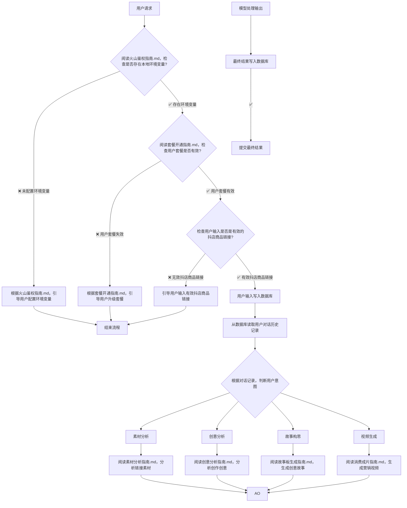

### 4. 高效绘制[流程图](https://github.com/knsv/mermaid#flowchart)

```mermaid
graph
    A[用户请求] --> B{阅读火山鉴权指南.md，检查是否存在本地环境变量?}
    B -->|❌ 未配置环境变量| C[根据火山鉴权指南.md，引导用户配置环境变量]-->ER[结束流程]
    B -->|✅ 存在环境变量| D{阅读套餐开通指南.md，检查用户套餐是否有效?}

    D -->|❌ 用户套餐失效| E[根据套餐开通指南.md，引导用户升级套餐]-->ER
    D -->|✅ 用户套餐有效| F{检查用户输入是否是有效的抖店商品链接?}
    
    F -->|❌ 无效抖店商品链接| G[引导用户输入有效抖店商品链接]-->ER
    F -->|✅ 有效抖店商品链接|H[用户输入写入数据库]

   H -->I[从数据库读取用户对话历史记录]-->J{根据对话记录，判断用户意图}
    J --> K[素材分析] -->KK[阅读素材分析指南.md，分析链接素材]-->AO
    J --> L[创意分析] -->LL[阅读创意分析指南.md，分析创作创意]-->AO
    J --> M[故事构思] -->MM[阅读故事板生成指南.md，生成创意故事]-->AO
    J --> N[视频生成] -->NN[阅读消费成片指南.md，生成营销视频]-->AO

    O[模型处理输出] --> Q[最终结果写入数据库] -->|✅| P[提交最终结果]
```